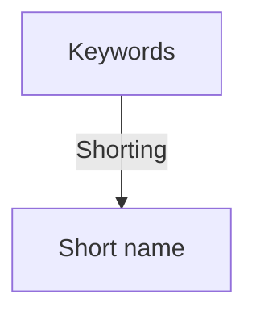

___
```
    ____      _    ____  
   |  _ \    / \  / ___| 
   | |_) |  / _ \ \___ \ 
   |  _ <  / ___ \ ___) |
   |_| \_\/_/   \_\____/ 
```

# GSN
Generate Short Name

[GSN](https://haithamaouati.github.io/GSN) is a free **Converter** arabic text to a format compatible with designing software.

## Table of Contents
- [Demo](#demo)
- [Reverse](#reverse)
- [Author](#author)
- [License](#license)

## Demo
Version: **1.0**
[https://haithamaouati.github.io/GSN](https://haithamaouati.github.io/GSN/)

## Reverse

**Flowchart**



>**Note**:
> Generate the short name by taking the first 3 letters of each keyword and concatenating them together.

## Author
Made with :heart: by **Haitham Aouati**

## License
This repository is under [Unlicense License](https://github.com/haithamaouati/ar2en/blob/main/LICENSE).

([Table of Contents](#table-of-contents))
